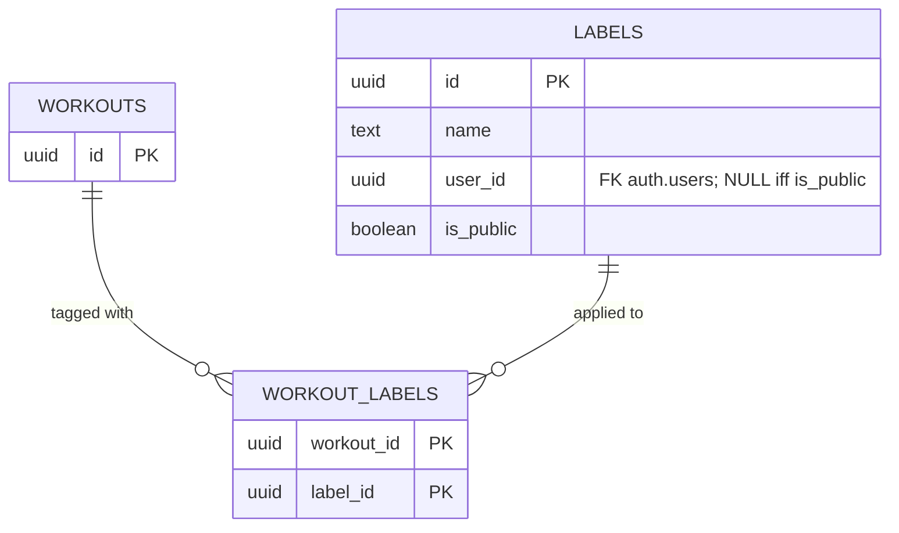
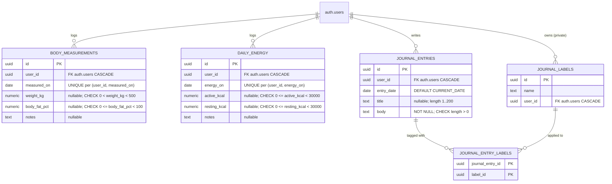
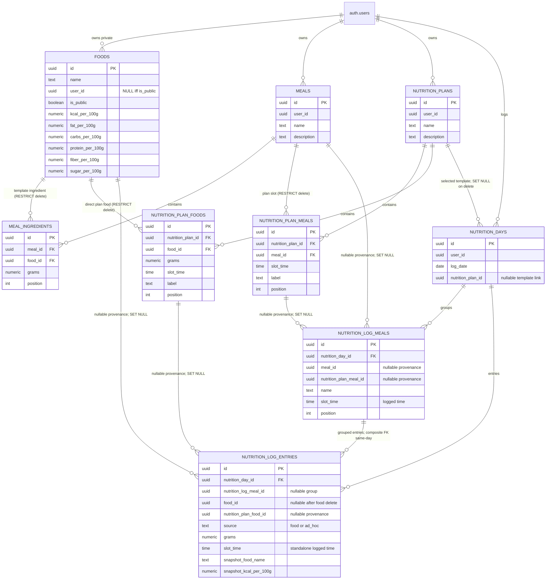

# Database schema

A map of NeoGym's Postgres schema. For the authoritative definitions, always read the migrations under `backend/nhost/migrations/default/` and the Hasura metadata under `backend/nhost/metadata/databases/default/tables/` — if there's a conflict, those win.

If you want quick reference for the **strength/cardio split** and **per-exercise metrics-schema**, see [`exercises.md`](exercises.md) and [`sessions.md`](sessions.md) — they cover the invariants in prose. For who can read/write what, see [`permissions.md`](permissions.md).

## Core domain — workouts, sessions, exercises

This is the heart of the app. Strength sets and cardio entries are the two child tables; everything above them is shared. The tree of ownership (top-down):

```
auth.users
  └─ workout_sessions                       (one row per "I worked out")
        └─ workout_session_exercises        (ordered list of exercises in that session)
              ├─ workout_session_strength_sets    (reps × weight, per set)   ← parent_kind = 'strength'
              └─ workout_session_cardio_entries   (jsonb metrics, per entry) ← parent_kind = 'cardio'

auth.users
  └─ workouts                               (reusable template: ordered exercises)
        └─ workout_exercises                (the template's exercise list)

auth.users
  └─ exercises                              (catalog row — admin-owned if is_public, else user-owned)
        ├─ exercises_strength               (1:1 sidecar, present iff kind = 'strength')
        └─ exercises_cardio                 (1:1 sidecar, present iff kind = 'cardio')
```

The session-side and template-side trees both reference `exercises` via composite FK on `(exercise_id, kind)`. `workout_sessions.workout_id` is nullable (ad-hoc sessions) and uses `ON DELETE SET NULL` — deleting a workout detaches every session it seeded rather than wiping history.

### The strength/cardio split (the load-bearing pattern)

The split between strength and cardio logging is enforced **structurally**, not by triggers. The pattern is the textbook discriminated-FK approach to exclusive subtypes (Bill Karwin's *SQL Antipatterns*, Joe Celko's *SQL for Smarties*).

1. `exercises.kind` is a `GENERATED ALWAYS … STORED` column derived from `category`:

   ```sql
   kind text GENERATED ALWAYS AS (CASE category WHEN 'cardio' THEN 'cardio' ELSE 'strength' END) STORED
   ```

   It collapses the seven-value `category` taxonomy (`cardio`, `strength`, `stretching`, `powerlifting`, `plyometrics`, `olympic_weightlifting`, `strongman`) into the binary discriminator that matters for routing.

2. `exercises` carries `UNIQUE (id, kind)` so child tables can target the pair via composite FK.

3. `workout_exercises` and `workout_session_exercises` each have their own `kind` column populated by a `BEFORE INSERT OR UPDATE OF exercise_id` trigger that copies from `exercises.kind`. The column has no client-meaningful value — it's a pure FK slot. If a client sends a wrong `kind`, the trigger overwrites it before the FK check runs.

4. `workout_session_exercises` also has `UNIQUE (id, kind)` for the same reason.

5. `workout_session_strength_sets.parent_kind` is pinned: `DEFAULT 'strength' CHECK (parent_kind = 'strength')`. `workout_session_cardio_entries.parent_kind` is pinned to `'cardio'` the same way. Each has a composite FK on `(workout_session_exercise_id, parent_kind) → workout_session_exercises(id, kind)`.

6. The sidecars repeat the pinned-kind pattern at the **catalog** level: `exercises_strength.kind` is `DEFAULT 'strength' CHECK (kind = 'strength')`, `exercises_cardio.kind` is `DEFAULT 'cardio' CHECK (kind = 'cardio')`, both with composite FK on `(exercise_id, kind) → exercises(id, kind) ON UPDATE CASCADE`. So a category flip that would change `exercises.kind` cascades into the sidecar's `kind`, the pinned CHECK rejects, and the whole transaction rolls back — the "exactly one sidecar per exercise, determined by kind" invariant is structural, not aspirational.

Net effect: a strength set whose parent session-exercise is cardio is an **FK violation** (SQLSTATE `23503`). A cardio entry on a strength parent is the mirror violation. A kind-changing `exercises.category` flip on an exercise with a sidecar attached (which every exercise has) is a CHECK violation. No trigger, no runtime check — declarative, in the Postgres catalog. See [`exercises.md`](exercises.md) for the full reasoning and [`backend/tests/kind-enforcement.test.ts`](../../backend/tests/kind-enforcement.test.ts) for the integration tests that prove it.

### Cardio metrics-schema validation

The composite FK enforces *which* sets/entries can attach to *which* parent. A separate `BEFORE INSERT OR UPDATE OF (metrics, workout_session_exercise_id)` trigger on `workout_session_cardio_entries` validates the *shape* of the `metrics` jsonb against the parent exercise's `exercises_cardio.metrics_schema` using `pg_jsonschema`. If the parent isn't cardio the trigger noops and lets the FK speak; if the parent is cardio but lacks a sidecar it raises `22023`; if the metrics don't match the schema it raises `23514` with the validation errors joined into the message.

There is no symmetric trigger on `workout_session_strength_sets` — strength sets have a fixed columnar shape (reps, weight), so there's nothing per-exercise to validate.

## Catalog enums and join tables

These are the small reference tables the catalog rows point at.


All seven enum tables are seeded in the init migration; only the value column exists. They're FKed for referential integrity, not for any computed behavior. The `exercise_categories` enum is what the `kind` GENERATED column reads when deriving cardio-vs-strength. `exercise_forces` and `exercise_mechanics` are referenced from the **`exercises_strength` sidecar** rather than the base — cardio rows don't have either.

`exercise_secondary_muscle_groups` is a pure association table (no timestamps, no id — composite PK `(exercise_id, muscle_group)`).

## Workout labels

Labels are a many-to-many tag system for workouts. Same shape as journal labels below (parallel design, separate tables).



## Auxiliary domains — body measurements, journal, and daily energy

These are unrelated to the workout/session model — they're separate per-user data streams attached directly to `auth.users`.



`daily_energy` mirrors body measurements as a private date-keyed metric stream: at least one of `active_kcal` or `resting_kcal` is required, each kcal value must be non-negative and below `30000`, and `(user_id, energy_on)` is unique. See [`energy.md`](energy.md) for the GraphQL and import-facing contract.

`workout_labels` uses the same "public-or-user-owned" visibility pattern as `exercises` and `workouts`: `is_public = true ⇔ user_id IS NULL`, enforced by a CHECK constraint. `journal_labels` is strictly private per-user — no `is_public` column, `user_id NOT NULL` — see [`permissions.md`](permissions.md) pattern A.

## Nutrition

Nutrition is a separate private/user-catalog domain for calorie intake. See [`nutrition.md`](nutrition.md) for invariants and operational caveats; this section is the schema map.



Foods reuse the owner-or-public catalog visibility invariant (`is_public = true` iff `user_id IS NULL`) and `UNIQUE NULLS NOT DISTINCT (user_id, name)`. Meal and plan templates are private roots. Plans can contain both meal slots (`nutrition_plan_meals`) and direct food slots (`nutrition_plan_foods`); clients merge those children by `(slot_time, position, kind, id)` using a shared per-slot `position` sequence. Logged day entries are historical facts: `nutrition_log_entries` has `source = 'food' | 'ad_hoc'` plus non-null `snapshot_*` food name/nutrient columns. Food-backed rows are populated by an insert-only trigger from `foods`; later food updates/deletes do not change those snapshots, and `food_id` can become null only after source-food deletion. Direct plan-food logs are standalone food-backed entries with nullable `nutrition_plan_food_id` provenance; a trigger rejects combining that provenance with a logged meal group or a mismatched `food_id`. Ad-hoc rows are standalone log-only snapshots with no `food_id`, `nutrition_plan_food_id`, or `nutrition_log_meal_id`, so they never join reusable catalogs or grouped/template provenance. Log `slot_time` values record the actual user-selected time-of-day (defaulting to now); planned meal provenance stays in `nutrition_plan_meal_id`, direct food provenance stays in `nutrition_plan_food_id`, and neither should force the logged time to the template slot time. The day-scoped ordering indexes for `nutrition_log_meals` and `nutrition_log_entries` are `(nutrition_day_id, slot_time, position, id)`, matching the slot-time-first daily intake display.

`nutrition_log_entries` also has a composite FK `(nutrition_log_meal_id, nutrition_day_id) -> nutrition_log_meals(id, nutrition_day_id) ON DELETE CASCADE`. With default `MATCH SIMPLE`, standalone entries (`nutrition_log_meal_id IS NULL`) skip that composite FK while still using the direct `nutrition_day_id` FK; grouped entries must point at a group on the same day. Because `nutrition_day_id` is present in both the direct and composite FKs, Hasura/Nhost metadata uses manual relationships for the affected day/group links rather than auto-tracking the ambiguous constraints.

## Public vs user-owned visibility

A pattern that recurs across `exercises`, `workouts`, `labels`, `foods`:

```sql
CHECK (
  (is_public = true  AND user_id IS NULL) OR
  (is_public = false AND user_id IS NOT NULL)
)
```

Combined with `UNIQUE NULLS NOT DISTINCT (user_id, name)`, this gives "public rows can't be private, private rows can't be public, and no two rows can share `(user_id, name)` — including the public namespace, where `user_id IS NULL` collides with itself."

The Hasura `user`-role select filter is `user_id = X-Hasura-User-Id OR is_public = true`, so users see their own rows plus the public catalog. Insert/update/delete are gated to `user_id = X-Hasura-User-Id AND is_public = false` — users cannot create or mutate public rows; those are admin-only via migrations + seeds.

## Cascade behavior

Most cascades are `ON DELETE CASCADE` from a private/user-owned root, so deleting a session removes its session-exercises which remove their sets/entries, and deleting a user removes their directly owned private streams. One direct-user cascade worth calling out here, plus the main domain exceptions:

| FK | Action | Why |
|---|---|---|
| `daily_energy.user_id` → `auth.users.id` | `ON DELETE CASCADE` | Daily energy is a private user-owned metric stream; deleting the account removes the user's energy history with the rest of their private data. |
| `workout_exercises.exercise_id` → `exercises.id` | `ON DELETE RESTRICT` | Deleting a catalog exercise that's used in any workout/session is forbidden — the user has to remove or replace it first. |
| `workout_session_exercises.exercise_id` → `exercises.id` | `ON DELETE RESTRICT` | Same reason, for session-level rows. |
| `workout_sessions.workout_id` → `workouts.id` | `ON DELETE SET NULL` | Deleting a workout detaches every session it seeded — they become ad-hoc, keeping their logged entries. The init migration used `CASCADE`, which silently destroyed session history; migration `1790000460000` switched to `SET NULL` to match the "template, not a contract" framing in [`sessions.md`](sessions.md). |
| `meal_ingredients.food_id` → `foods.id` | `ON DELETE RESTRICT` | A food used by any meal template cannot be deleted until the template reference is removed. This includes public foods referenced by users. |
| `nutrition_plan_meals.meal_id` → `meals.id` | `ON DELETE RESTRICT` | A meal used by a daily plan template cannot be deleted until the plan slot is removed. |
| `nutrition_plan_foods.nutrition_plan_id` → `nutrition_plans.id` | `ON DELETE CASCADE` | Direct food slots are owned children of the reusable plan template and are removed with it. |
| `nutrition_plan_foods.food_id` → `foods.id` | `ON DELETE RESTRICT` | A food used directly in a daily plan template cannot be deleted until the plan-food slot is removed. This includes public foods referenced by users. |
| `nutrition_days.nutrition_plan_id` → `nutrition_plans.id` | `ON DELETE SET NULL` | Selected plans are suggestions/templates only; deleting a plan detaches historical days. |
| `nutrition_log_meals.meal_id` / `nutrition_plan_meal_id` | `ON DELETE SET NULL` | Logged meal provenance detaches when templates are removed; historical log groups remain. |
| `nutrition_log_entries.food_id` → `foods.id` | `ON DELETE SET NULL` | Food-backed log provenance detaches when a source food is deleted; `source = 'food'` and trusted snapshot columns remain. Ad-hoc rows have `food_id IS NULL` from insert. |
| `nutrition_log_entries.nutrition_plan_food_id` → `nutrition_plan_foods.id` | `ON DELETE SET NULL` | Direct plan-food provenance detaches when the template slot is removed; consumed grams and trusted snapshots remain historical facts. |
| `nutrition_log_entries (nutrition_log_meal_id, nutrition_day_id)` → `nutrition_log_meals(id, nutrition_day_id)` | `ON DELETE CASCADE` | Deleting a logged meal group deletes its grouped entries and the composite FK rejects wrong-day group children. |

## Triggers

There are a handful of meaningful triggers; the rest are stock `updated_at` setters on every `BEFORE UPDATE`.

| Table | Trigger | Fires on | What it does |
|---|---|---|---|
| `workout_exercises` | `sync_public_workout_exercises_kind` | `BEFORE INSERT OR UPDATE OF exercise_id, kind` | Copies `kind` from the parent `exercises.kind`, overwriting any client-supplied value (including on UPDATE OF `kind` itself, so a client can't bypass the FK by re-pointing `kind` without changing `exercise_id`). |
| `workout_session_exercises` | `sync_public_workout_session_exercises_kind` | `BEFORE INSERT OR UPDATE OF exercise_id, kind` | Same. |
| `workout_session_cardio_entries` | `validate_public_workout_session_cardio_entries_metrics` | `BEFORE INSERT OR UPDATE OF metrics, workout_session_exercise_id` | Validates `metrics` against `exercises_cardio.metrics_schema` via `pg_jsonschema`. Noops if the parent isn't cardio so the FK can give a clearer error. |
| `exercises` | `exercise_must_have_sidecar` | `CONSTRAINT TRIGGER — AFTER INSERT, DEFERRABLE INITIALLY DEFERRED (fires at commit)` | At commit, raises `23503` if the inserted exercise has no matching sidecar (`exercises_strength` for kind=strength, `exercises_cardio` for kind=cardio). Deferral lets clients insert the exercise and its sidecar in either order within one transaction — the natural shapes are Hasura nested mutation or a SQL CTE. |
| `exercises_strength`, `exercises_cardio` | `<sidecar>_no_orphan_parent` | `CONSTRAINT TRIGGER — AFTER DELETE, DEFERRABLE INITIALLY DEFERRED (fires at commit)` | At commit, raises `23503` if the deleted sidecar's parent exercise still exists. CASCADE from `DELETE FROM exercises` removes both atomically (parent gone, check passes); standalone sidecar DELETEs trip the check and roll back. |
| `nutrition_log_entries` | `populate_public_nutrition_log_entry_food_snapshot` | `BEFORE INSERT` | Branches on `source`. Food-backed rows require a non-null `food_id` and copy food name plus per-100g nutrients into trusted `snapshot_*` columns, overwriting client input. Ad-hoc rows preserve user-supplied standalone snapshots and are validated by table checks. |
| `nutrition_log_entries` | `guard_public_nutrition_log_entry_snapshot_immutability` | `BEFORE UPDATE OF source, snapshot_*` | Rejects `source` changes and protects food-backed snapshot/name columns while allowing ad-hoc snapshot edits and ordinary grams/position/slot_time corrections. |
| `nutrition_log_entries` | `check_public_nutrition_log_entry_plan_food_provenance` | `BEFORE INSERT OR UPDATE OF nutrition_plan_food_id, nutrition_log_meal_id, food_id` | Allows `nutrition_plan_food_id` only on standalone log entries and rejects rows whose `food_id` differs from the referenced direct plan-food slot. |

The `pg_jsonschema` extension (`CREATE EXTENSION` in migration `1790000400000`) provides the three functions used here: `jsonschema_is_valid`, `jsonb_matches_schema`, `jsonschema_validation_errors`.
