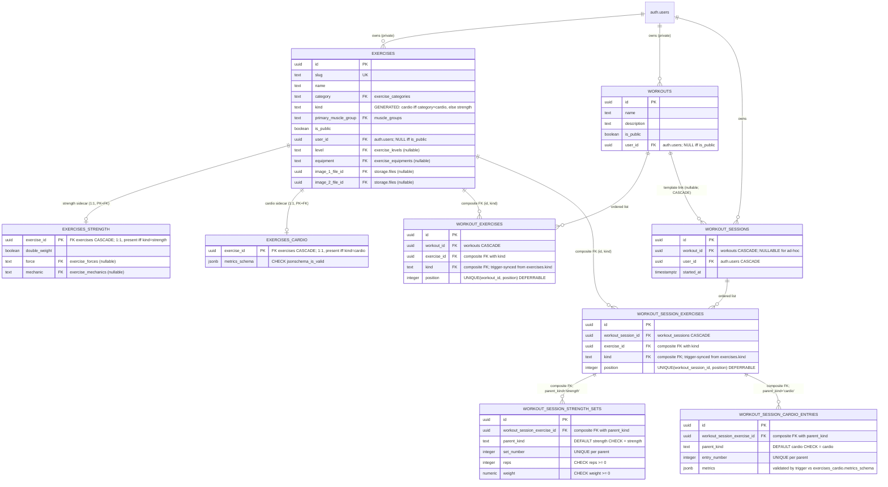
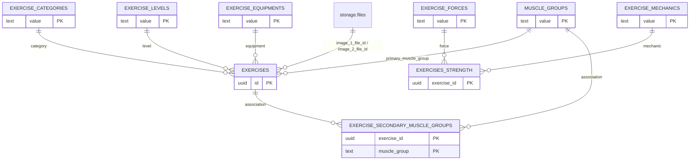
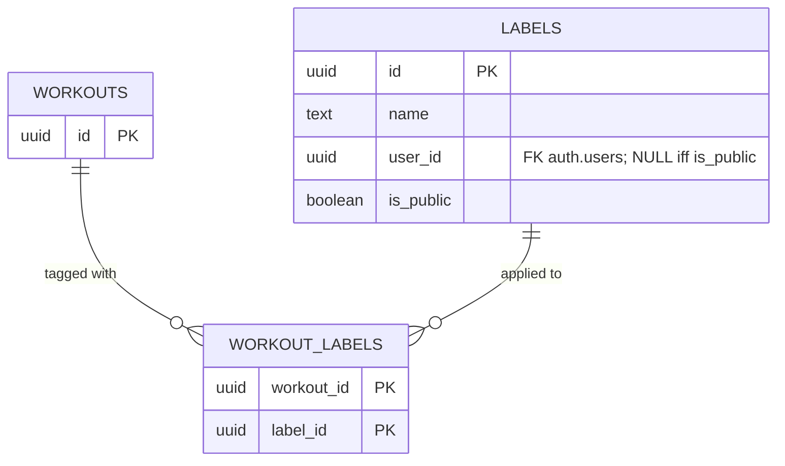
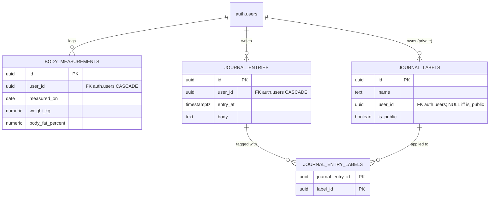

# Database schema

A visual map of NeoGym's Postgres schema. The diagrams below are Mermaid ER diagrams — GitHub renders them natively, and most IDEs (VS Code with the Markdown Preview Mermaid Support extension, JetBrains with Mermaid plugin) do too.

If you only want quick reference for the **strength/cardio split** and **per-exercise metrics-schema**, see [`exercises.md`](exercises.md) and [`sessions.md`](sessions.md) — they cover the invariants in prose. This document focuses on the shape: what tables exist, how they connect, and which keys do the load-bearing work.

For the authoritative definitions, always read the migrations under `backend/nhost/migrations/default/`. The diagram lags reality — if there's a conflict, the migration wins.

## Core domain — workouts, sessions, exercises

This is the heart of the app. Strength sets and cardio entries are the two child tables; everything above them is shared.



### The strength/cardio split (the load-bearing pattern)

The split between strength and cardio logging is enforced **structurally**, not by triggers. The pattern is the textbook discriminated-FK approach to exclusive subtypes (Bill Karwin's *SQL Antipatterns*, Joe Celko's *SQL for Smarties*).

1. `exercises.kind` is a `GENERATED ALWAYS … STORED` column derived from `category`:
   ```sql
   kind text GENERATED ALWAYS AS (CASE category WHEN 'cardio' THEN 'cardio' ELSE 'strength' END) STORED
   ```
   It collapses the seven-value `category` taxonomy (`cardio`, `strength`, `stretching`, `powerlifting`, `plyometrics`, `olympic_weightlifting`, `strongman`) into the binary discriminator that matters for routing.

2. `exercises` carries `UNIQUE (id, kind)` so child tables can target the pair via composite FK.

3. `workout_exercises` and `workout_session_exercises` each have their own `kind` column populated by a `BEFORE INSERT OR UPDATE OF exercise_id` trigger that copies from `exercises.kind`. The column has no client-meaningful value — it's a pure FK slot. If a client sends a wrong `kind`, the trigger overwrites it before the FK check runs.

4. `workout_session_exercises` also has `UNIQUE (id, kind)` for the same reason.

5. `workout_session_strength_sets.parent_kind` is pinned: `DEFAULT 'strength' CHECK (parent_kind = 'strength')`. `workout_session_cardio_entries.parent_kind` is pinned to `'cardio'` the same way. Each has a composite FK on `(workout_session_exercise_id, parent_kind) → workout_session_exercises(id, kind)`.

Net effect: a strength set whose parent session-exercise is cardio is an **FK violation** (SQLSTATE `23503`). A cardio entry on a strength parent is the mirror violation. No trigger, no runtime check — declarative, in the Postgres catalog. See [`exercises.md`](exercises.md) for the full reasoning and [`backend/tests/kind-enforcement.test.ts`](../../backend/tests/kind-enforcement.test.ts) for the integration tests that prove it.

### Cardio metrics-schema validation

The composite FK enforces *which* sets/entries can attach to *which* parent. A separate `BEFORE INSERT OR UPDATE OF (metrics, workout_session_exercise_id)` trigger on `workout_session_cardio_entries` validates the *shape* of the `metrics` jsonb against the parent exercise's `exercises_cardio.metrics_schema` using `pg_jsonschema`. If the parent isn't cardio the trigger noops and lets the FK speak; if the parent is cardio but lacks a sidecar it raises `22023`; if the metrics don't match the schema it raises `23514` with the validation errors joined into the message.

There is no symmetric trigger on `workout_session_strength_sets` — strength sets have a fixed columnar shape (reps, weight), so there's nothing per-exercise to validate.

## Catalog enums and join tables

These are the small reference tables the catalog rows point at.



All seven enum tables are seeded in the init migration; only the value column exists. They're FKed for referential integrity, not for any computed behavior. The `exercise_categories` enum is what the `kind` GENERATED column reads when deriving cardio-vs-strength. `exercise_forces` and `exercise_mechanics` are referenced from the **`exercises_strength` sidecar** rather than the base — cardio rows don't have either.

`exercise_secondary_muscle_groups` is a pure association table (no timestamps, no id — composite PK `(exercise_id, muscle_group)`).

## Workout labels

Labels are a many-to-many tag system for workouts. Same shape as journal labels below (parallel design, separate tables).



## Auxiliary domains — body measurements and journal

These are unrelated to the workout/session model — they're separate per-user data streams attached directly to `auth.users`.



`journal_labels` and `workout_labels` use the same "public-or-user-owned" visibility pattern as `exercises` and `workouts`: `is_public = true ⇔ user_id IS NULL`, enforced by a CHECK constraint.

## Public vs user-owned visibility

A pattern that recurs across `exercises`, `workouts`, `labels`, `journal_labels`:

```sql
CHECK (
  (is_public = true  AND user_id IS NULL) OR
  (is_public = false AND user_id IS NOT NULL)
)
```

Combined with `UNIQUE NULLS NOT DISTINCT (user_id, name)`, this gives "public rows can't be private, private rows can't be public, and no two rows can share `(user_id, name)` — including the public namespace, where `user_id IS NULL` collides with itself."

The Hasura `user`-role select filter is `user_id = X-Hasura-User-Id OR is_public = true`, so users see their own rows plus the public catalog. Insert/update/delete are gated to `user_id = X-Hasura-User-Id AND is_public = false` — users cannot create or mutate public rows; those are admin-only via migrations + seeds.

## Cascade behavior

Most cascades are `ON DELETE CASCADE` from a session/workout root, so deleting a session removes its session-exercises which remove their sets/entries. Two exceptions worth knowing:

| FK | Action | Why |
|---|---|---|
| `workout_exercises.exercise_id` → `exercises.id` | `ON DELETE RESTRICT` | Deleting a catalog exercise that's used in any workout/session is forbidden — the user has to remove or replace it first. |
| `workout_session_exercises.exercise_id` → `exercises.id` | `ON DELETE RESTRICT` | Same reason, for session-level rows. |
| `workout_sessions.workout_id` → `workouts.id` | `ON DELETE CASCADE` | Deleting a workout cascades to every session created from it. The column is nullable for ad-hoc sessions, but the CASCADE wasn't changed when nullability was added — see [`sessions.md`](sessions.md) → "What happens if the workout is deleted" for the sharp edge. |

## Triggers

There are a handful of meaningful triggers; the rest are stock `updated_at` setters on every `BEFORE UPDATE`.

| Table | Trigger | Fires on | What it does |
|---|---|---|---|
| `workout_exercises` | `sync_public_workout_exercises_kind` | `BEFORE INSERT OR UPDATE OF exercise_id` | Copies `kind` from the parent `exercises.kind`, overwriting any client-supplied value. |
| `workout_session_exercises` | `sync_public_workout_session_exercises_kind` | `BEFORE INSERT OR UPDATE OF exercise_id` | Same. |
| `workout_session_cardio_entries` | `validate_public_workout_session_cardio_entries_metrics` | `BEFORE INSERT OR UPDATE OF metrics, workout_session_exercise_id` | Validates `metrics` against `exercises_cardio.metrics_schema` via `pg_jsonschema`. Noops if the parent isn't cardio so the FK can give a clearer error. |

The `pg_jsonschema` extension (`CREATE EXTENSION` in migration `1790000400000`) provides the three functions used here: `jsonschema_is_valid`, `jsonb_matches_schema`, `jsonschema_validation_errors`.
